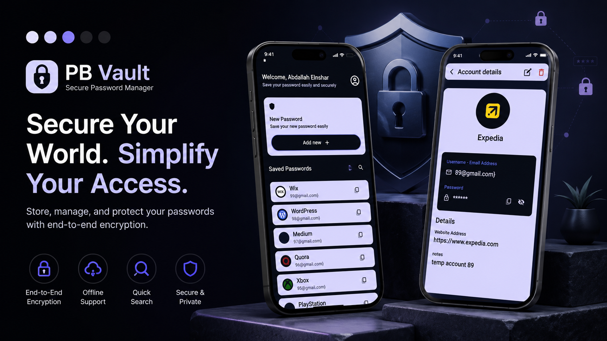
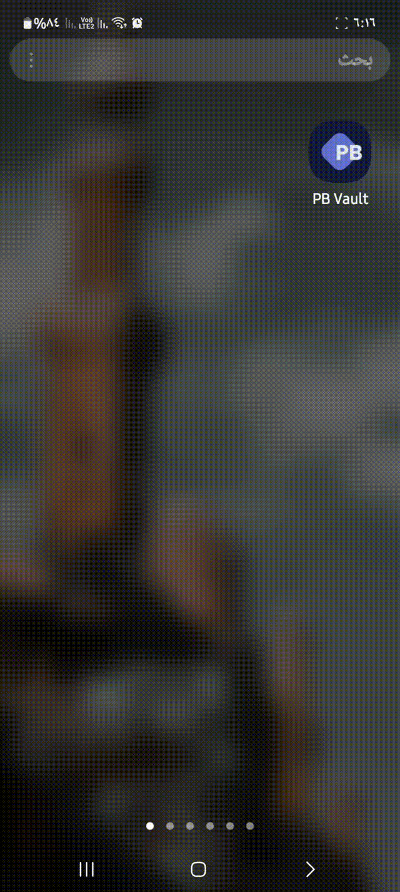
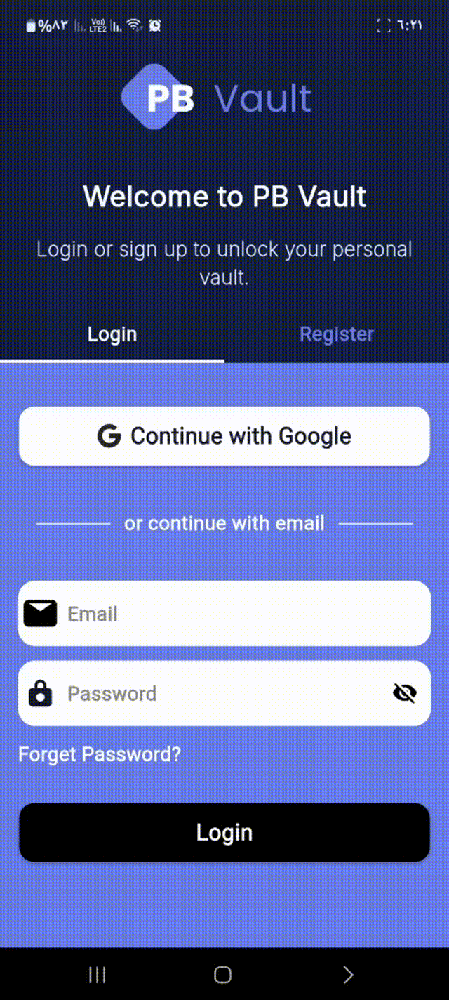
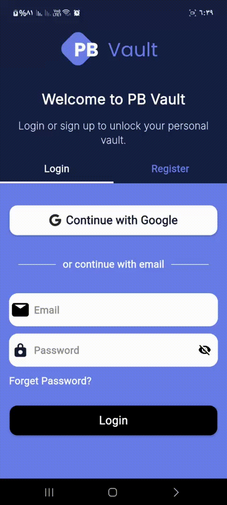
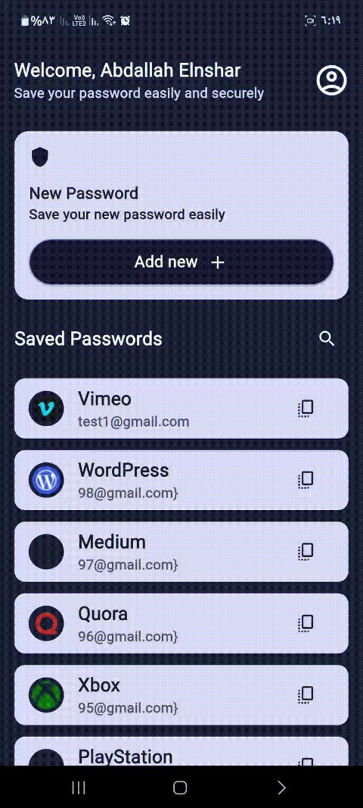
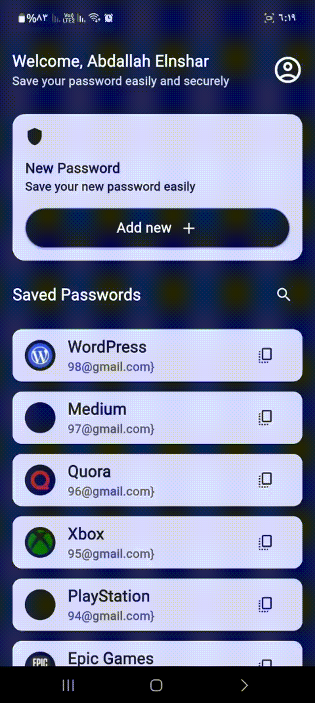
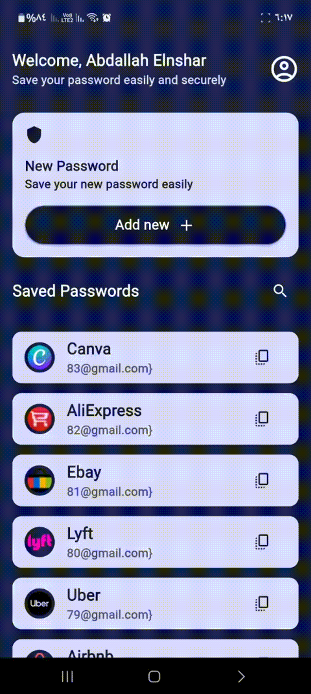
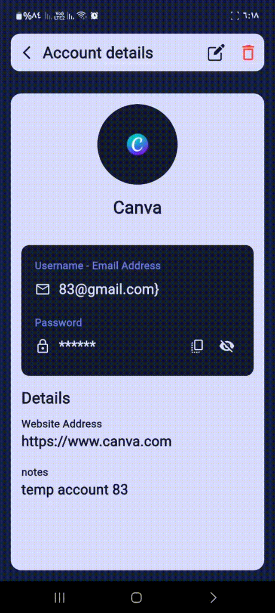
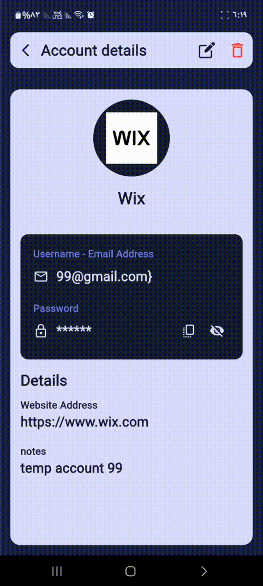
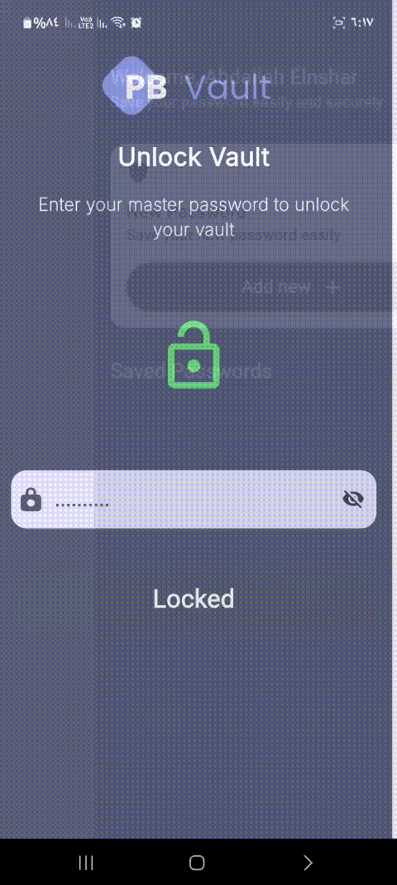

# 🔐 PB Vault



<p>
<b>PB Vault</b> is a secure password manager built with Flutter, designed to help users safely store, organize, and manage their credentials across multiple platforms. 
Passwords are encrypted before being stored, ensuring that sensitive information remains protected while providing a smooth and user-friendly experience. 🚀🔒
</p>

<hr/>

## 🚀 Features


  <li>
    <b>Authentication System</b>
    <ul>
      <li>Secure email & password authentication 🔑</li>
      <li>Google Sign-In support 🚀</li>
      <li>User account management</li>
    </ul>
  </li>

  <li>
    <b>Password Vault</b>
    <ul>
      <li>Create and save platform accounts securely 🔐</li>
      <li>Edit existing passwords and account information ✏️</li>
      <li>Delete stored accounts 🗑️</li>
      <li>Store platform name, email, username, password, and notes</li>
      <li><b>Built-in Strong Password Generator</b> 🎲</li>
    </ul>
  </li>

  <li>
    <b>Advanced Search</b>
    <ul>
      <li>Search accounts instantly by platform name 🔍</li>
      <li>Search using registered email addresses 📧</li>
      <li>Fast filtering experience for large vaults</li>
    </ul>
  </li>

  <li>
    <b>Security & Encryption</b>
    <ul>
      <li>Passwords are encrypted before storage 🔒</li>
      <li>Sensitive data is never stored as plain text</li>
      <li>Built with a dedicated encryption layer using cryptography</li>
      <li><b>Master Password Protection</b> with PBKDF2 hashing 🔑</li>
      <li><b>Change Master Password</b> with automatic vault re-encryption 🔄</li>
      <li><b>Biometric Authentication</b> (Fingerprint & Face ID) support 🖐️🆔</li>
    </ul>
  </li>

  <li>
    <b>Localization</b>
    <ul>
      <li>English 🇺🇸 and Arabic 🇪🇬 support</li>
      <li>Easy language switching</li>
    </ul>
  </li>

  <li>
    <b>Modern UI</b>
    <ul>
      <li>Clean and responsive design ✨</li>
      <li>Dark Mode support 🌙</li>
      <li>Shimmer loading effects for better UX</li>
    </ul>
  </li>


<hr/>

## 🎬 Demo

<p align="center">
  
</p>

<p align="center">
  
  
</p>

<p align="center">
  
</p>

<p align="center">
  
  
  
</p>

<p align="center">
  
  
</p>

<hr/>

## 📦 Packages Used

### 🔐 Authentication

* firebase_auth
* google_sign_in
* local_auth (Biometrics)

### ☁️ Backend & Database

* cloud_firestore

### 🧠 State Management

* flutter_bloc
* provider

### 🌍 Localization

* easy_localization

### 🔒 Security & Encryption

* cryptography
* flutter_secure_storage

### 💾 Local Storage

* shared_preferences

<hr/>

## 🔮 Upcoming Features

* Password Strength Analysis
* Account Categories
* Favorites & Pinned Accounts
* Export / Import Vault Data
* Auto Backup & Restore

<hr/>
## 🧱 Architecture

This project follows the principles of:

* Clean Architecture
* SOLID Principles
* Feature-based Structure
* Repository Pattern

<hr/>

## 🛠 Installation & Run

```bash
git clone https://github.com/abdallahelnshar123-ux/pb-vault.git

cd pb-vault

flutter pub get

flutter run
```

<hr/>

## 👨‍💻 Author & License

### Abdallah Samir El nshar

This app is part of my Flutter development journey and focuses on building scalable, clean, and 
production-ready applications. 🚀

Thank you for checking out my work! 🙏

This project is open source and available under the **MIT License**.
#
#
